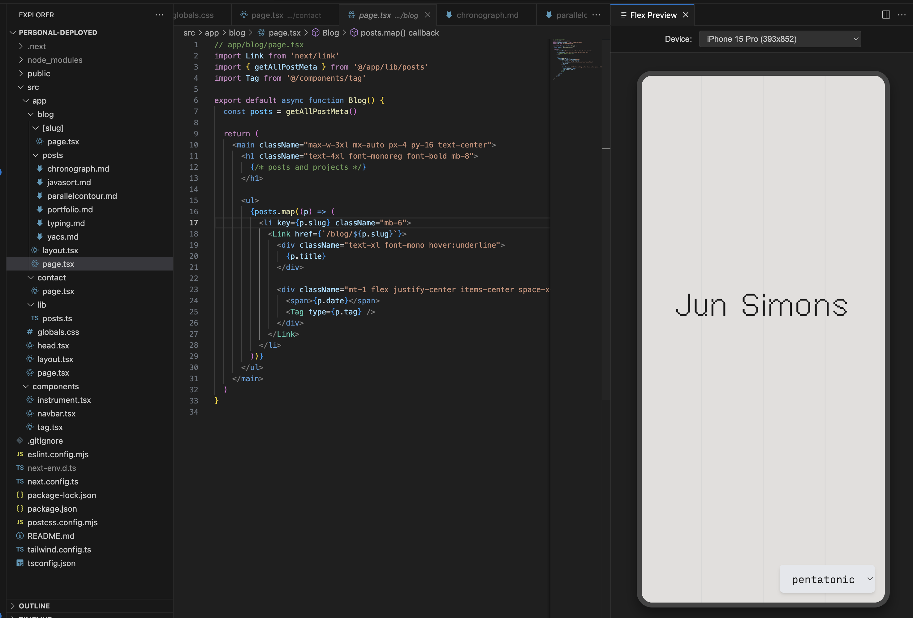
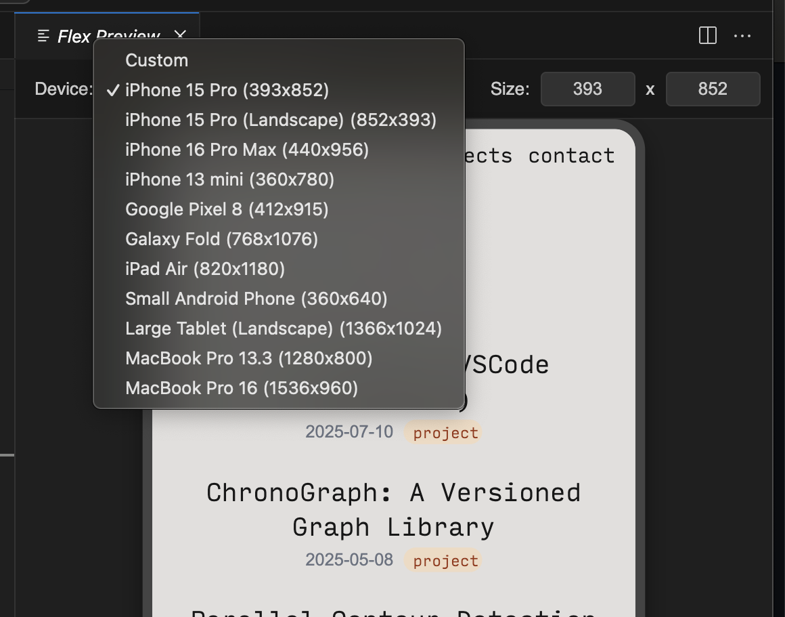

# Flex Preview

*Test responsive websites with ease!*

Flex Preview is a completely free VSCode Extension for easy mobile previews at any custom device resolution. It includes multiple preset device resolutions in addition to custom scaling.

To get started:

1) Install on the VSCode extensions marketplace
2) Press Ctrl+Shift+P (windows) or Cmd+Shift+P (macOS) to open the Command Palette
3) Find `Flex Preview: Show Preview` in the control palette.
4) Enter your desired URL

To use with a development server, simply start your development server and enter its URL.

## Features

Flex Preview provides a simple and powerful way to test the responsiveness of your web applications directly within your editor.

### Live Preview with Interactive Controls

Instantly launch a preview panel with a convenient dropdown menu to switch between devices. This is perfect for local development servers (e.g., `http://localhost:3000`) or viewing any live URL.  A reload button allows you to reload the URL entered in the extension's input box.

### Automatic Responsive Scaling

The device preview automatically and smoothly scales down to fit the available space in your editor panel. This allows you to test high-resolution tablet layouts without ever overflowing the screen, while the website inside renders at its true resolution.

### Custom Device Resolutions

Flex Preview comes with a number of preset device resolutions ranging from common smartphones to tablets and laptops. 

For more flexibility, you can enter custom resolutions into the height and width input boxes using the included UI.

In addition to the UI, Flex Preview provides a number of commands that can be selected from the Command Pallet (Ctrl+Shift+P for Windows or Cmd+Shift+P for macOS)
- `Flex Preview: Show Extension` - Launches the preview panel.
- `Flex Preview: Set Custom Resolution` - Prompts for a custom width and height.
- `Flex Preview: Select Preset Resolution` - Provides a command-based alternative to the UI dropdown.

## Requirements

This extension requires Visual Studio Code version `1.86.0` or higher.

## Extension Settings

This extension does not contribute any VS Code settings at this time.

## Release Notes

## 1.1.2

Additions:
* URL input box
* Reload button
* Fixed horizontal scrolling in menu bar

## 1.0.3

Additions:
* UI width/height box
* Improved smooth scaling

Bug fixes:
* extension running in background fixed
* resize command fixed
* lowered VSCode version requirement

### 1.0.0

Initial release of Flex Preview, featuring:
* Live preview webview panel.
* Preset and custom device resolutions.
* Interactive dropdown for device selection.
* Automatic scaling to fit the editor panel.

---

**Enjoy!**