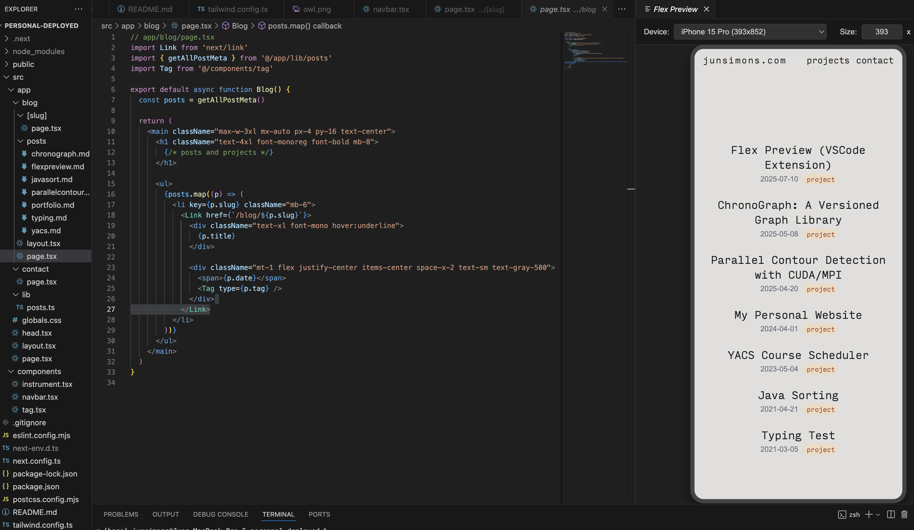

# Flex Preview

*Test responsive websites with ease!*

Flex Preview is a VSCode Extension for easy mobile previews at any custom device resolution. It also supports multiple preset device resolutions in addition to custom scaling.

## Features

Flex Preview provides a simple and powerful way to test the responsiveness of your web applications directly within your editor.

### Live Preview with Interactive Controls

Instantly launch a preview panel with a convenient dropdown menu to switch between devices. This is perfect for local development servers (e.g., `http://localhost:3000`) or viewing any live URL.

### Automatic Responsive Scaling

The device preview automatically and smoothly scales down to fit the available space in your editor panel. This allows you to test high-resolution tablet layouts without ever overflowing the screen, while the website inside renders at its true resolution.

### Custom Device Resolutions

For precise testing, use the Command Palette to set any custom width and height you need.  For many, the preset options may be enough!
- `Flex Preview: Show Preview` - Launches the preview panel.
- `Flex Preview: Set Custom Resolution` - Prompts for a custom width and height.
- `Flex Preview: Select Preset Resolution` - Provides a command-based alternative to the UI dropdown.

## Requirements

This extension requires Visual Studio Code version `1.86.0` or higher.

## Extension Settings

This extension does not contribute any VS Code settings at this time.

## Release Notes

## [1.0.1] - 2025-06-12

### Changed

- Lowered the required VS Code engine version from `^1.100.0` to `^1.86.0` to support a wider range of recent editor versions.

### 1.0.0

Initial release of Flex Preview, featuring:
* Live preview webview panel.
* Preset and custom device resolutions.
* Interactive dropdown for device selection.
* Automatic scaling to fit the editor panel.

---

**Enjoy!**